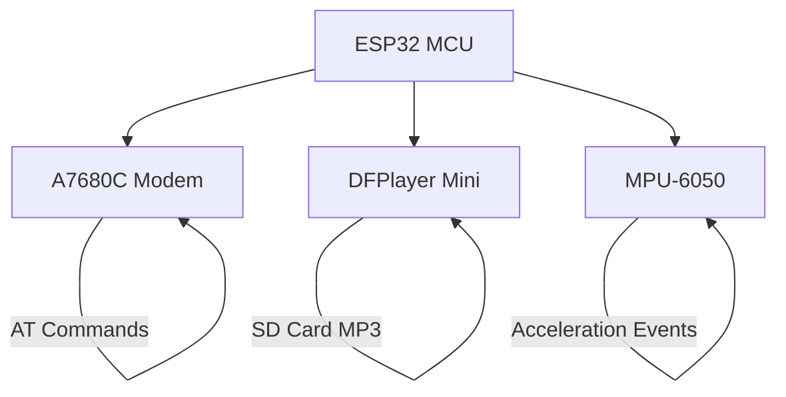
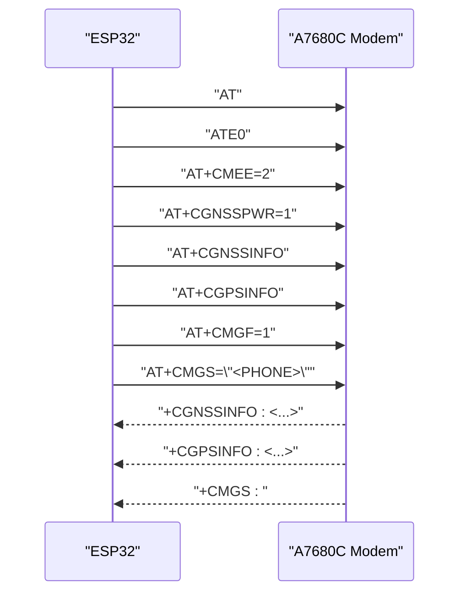
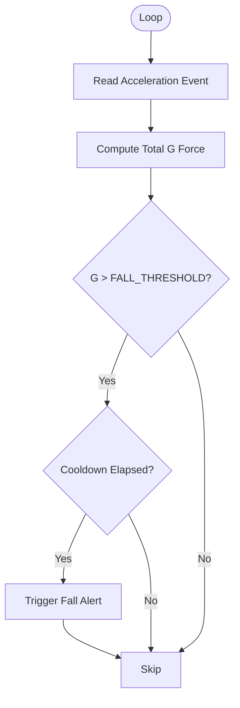
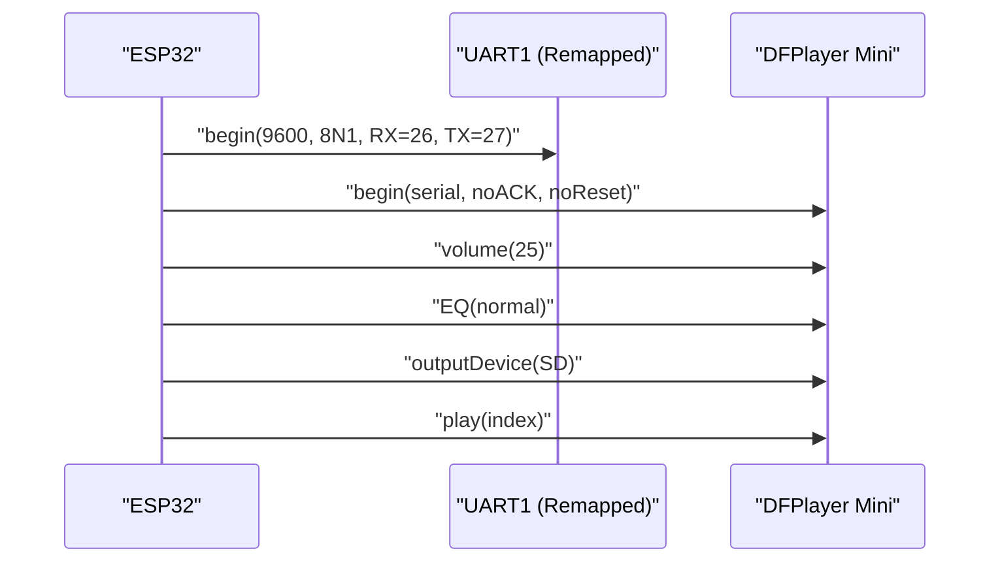
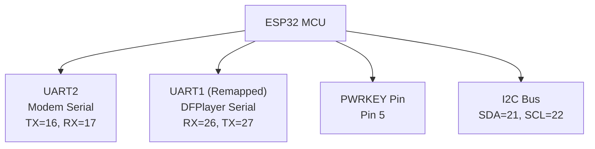
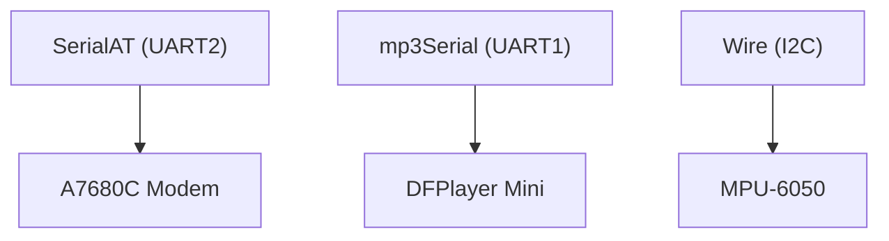

# Hardware Components

<cite>
**Referenced Files in This Document**
- [A7680C_gps.ino](file://A7680C_gps.ino)
</cite>

## Table of Contents
1. [Introduction](#introduction)
2. [Project Structure](#project-structure)
3. [Core Components](#core-components)
4. [Architecture Overview](#architecture-overview)
5. [Detailed Component Analysis](#detailed-component-analysis)
6. [Dependency Analysis](#dependency-analysis)
7. [Performance Considerations](#performance-considerations)
8. [Troubleshooting Guide](#troubleshooting-guide)
9. [Conclusion](#conclusion)
10. [Appendices](#appendices)

## Introduction
This document provides a comprehensive guide to the hardware components of the GPS tracker system. It covers the Quectel A7680C GNSS/GSM module for positioning and cellular communication, the MPU-6050 accelerometer and gyroscope for fall detection, the DFPlayer Mini audio system for audible alerts, and the ESP32 microcontroller with power management and serial communication. It includes pin assignments, wiring considerations, component specifications, and practical guidance for field deployment.

## Project Structure
The project is centered around a single Arduino sketch that orchestrates all hardware components. The code defines pin mappings, initializes peripherals, and implements GNSS polling, LBS fallback, SMS messaging, fall detection, and audio playback.

```mermaid
graph TB
subgraph "Microcontroller"
ESP32["ESP32 MCU"]
end
subgraph "Peripherals"
Modem["Quectel A7680C<br/>GNSS/GSM"]
DFPlayer["DFPlayer Mini<br/>Audio"]
MPU["MPU-6050<br/>Accel + Gyro"]
end
subgraph "Power"
Power["Power Supply<br/>Regulation"]
end
ESP32 --> Modem
ESP32 --> DFPlayer
ESP32 --> MPU
ESP32 --> Power
```

**Diagram sources**
- [A7680C_gps.ino](file://A7680C_gps.ino#L23-L31)
- [A7680C_gps.ino](file://A7680C_gps.ino#L68-L71)

**Section sources**
- [A7680C_gps.ino](file://A7680C_gps.ino#L20-L31)
- [A7680C_gps.ino](file://A7680C_gps.ino#L555-L575)

## Core Components
- Quectel A7680C GNSS/GSM module: Powers on GNSS, polls for coordinates, and sends SMS via AT commands. Supports LBS fallback for fast location acquisition.
- MPU-6050 accelerometer and gyroscope: Performs fall detection using acceleration magnitude thresholds.
- DFPlayer Mini audio module: Plays pre-recorded MP3 messages from an SD card.
- ESP32 microcontroller: Hosts all logic, manages serial communications, and controls peripheral initialization.

Key pin assignments and roles:
- Modem serial: TX on pin 16, RX on pin 17; power key on pin 5.
- DFPlayer serial: RX on pin 26, TX on pin 27 (UART1 remapped).
- MPU-6050 I2C: SDA on pin 21, SCL on pin 22.

**Section sources**
- [A7680C_gps.ino](file://A7680C_gps.ino#L23-L31)
- [A7680C_gps.ino](file://A7680C_gps.ino#L68-L71)

## Architecture Overview
The system architecture integrates three primary hardware subsystems controlled by the ESP32:
- GNSS/GSM subsystem for positioning and cellular messaging.
- Audio subsystem for audible alerts.
- Motion detection subsystem for fall detection.



**Diagram sources**
- [A7680C_gps.ino](file://A7680C_gps.ino#L68-L71)
- [A7680C_gps.ino](file://A7680C_gps.ino#L153-L213)
- [A7680C_gps.ino](file://A7680C_gps.ino#L227-L240)

## Detailed Component Analysis

### Quectel A7680C GNSS/GSM Module
- Role: Provides GNSS positioning and cellular connectivity. The implementation powers on GNSS using a minimal AT command set and polls for coordinates. It also supports LBS fallback and SMS sending.
- GNSS initialization: Attempts AT+CGNSSPWR=1; if unsupported, falls back to AT+CGPS=1. Satellite count is queried via AT+CGNSSINFO or AT+CGPSSTATUS? depending on the selected command set.
- Positioning: Coordinates are parsed from AT+CGPSINFO responses and converted from DMM to DD format.
- Cellular messaging: SMS is sent using AT+CMGF=1 and AT+CMGS with Ctrl+Z termination. Responses are parsed to detect success or failure.
- Power-on sequence: Uses a pulse on the PWRKEY pin to initiate module startup.



**Diagram sources**
- [A7680C_gps.ino](file://A7680C_gps.ino#L567-L598)
- [A7680C_gps.ino](file://A7680C_gps.ino#L518-L549)
- [A7680C_gps.ino](file://A7680C_gps.ino#L354-L378)
- [A7680C_gps.ino](file://A7680C_gps.ino#L265-L302)

**Section sources**
- [A7680C_gps.ino](file://A7680C_gps.ino#L567-L598)
- [A7680C_gps.ino](file://A7680C_gps.ino#L518-L549)
- [A7680C_gps.ino](file://A7680C_gps.ino#L354-L378)
- [A7680C_gps.ino](file://A7680C_gps.ino#L265-L302)

### MPU-6050 Accelerometer and Gyroscope Integration
- Purpose: Detects falls by monitoring acceleration magnitude across axes.
- Initialization: Initializes I2C on SDA/SCL pins, sets accelerometer range, gyro range, and filter bandwidth.
- Detection logic: Computes total G-force from acceleration vector and compares against a configurable threshold. A cooldown prevents repeated triggers.



**Diagram sources**
- [A7680C_gps.ino](file://A7680C_gps.ino#L227-L240)
- [A7680C_gps.ino](file://A7680C_gps.ino#L242-L259)

**Section sources**
- [A7680C_gps.ino](file://A7680C_gps.ino#L227-L240)
- [A7680C_gps.ino](file://A7680C_gps.ino#L242-L259)

### DFPlayer Mini Audio System
- Setup: Initializes DFPlayer on a dedicated UART with remapped pins. Disables ACK waiting to avoid hangs. Configures EQ, output device, and volume.
- SD card preparation: Requires MP3 files named with zero-padded three-digit numbers (e.g., 001.mp3). The code references specific filenames for different events.
- Playback: Plays a file by index and checks player state and file counts.



**Diagram sources**
- [A7680C_gps.ino](file://A7680C_gps.ino#L153-L213)

**Section sources**
- [A7680C_gps.ino](file://A7680C_gps.ino#L153-L213)

### ESP32 Microcontroller, Power Management, and Serial Communication
- Serial communication:
  - Modem serial: HardwareSerial on UART2 with TX/RX on pins 16/17.
  - DFPlayer serial: HardwareSerial on UART1 remapped to pins 26/27 to avoid conflicts.
- Power management:
  - Power-on pulse via PWRKEY pin to activate the A7680C module.
  - Boot sequence initializes serial ports, performs basic AT commands, and then initializes peripherals.
- Pin assignments:
  - Modem: TX=16, RX=17, PWRKEY=5.
  - DFPlayer: RX=26, TX=27.
  - MPU-6050: SDA=21, SCL=22.



**Diagram sources**
- [A7680C_gps.ino](file://A7680C_gps.ino#L23-L31)
- [A7680C_gps.ino](file://A7680C_gps.ino#L68-L71)
- [A7680C_gps.ino](file://A7680C_gps.ino#L138-L147)

**Section sources**
- [A7680C_gps.ino](file://A7680C_gps.ino#L23-L31)
- [A7680C_gps.ino](file://A7680C_gps.ino#L68-L71)
- [A7680C_gps.ino](file://A7680C_gps.ino#L138-L147)

## Dependency Analysis
- HardwareSerial instances:
  - SerialAT (UART2) for the A7680C modem.
  - mp3Serial (UART1 remapped) for DFPlayer.
- I2C bus for MPU-6050.
- Global flags and timers coordinate GNSS polling, SMS scheduling, and fall detection cooldown.



**Diagram sources**
- [A7680C_gps.ino](file://A7680C_gps.ino#L68-L71)

**Section sources**
- [A7680C_gps.ino](file://A7680C_gps.ino#L68-L71)

## Performance Considerations
- GNSS polling interval: The code polls AT+CGPSINFO every 5 seconds for logging and updates satellite count periodically. Adjust intervals based on battery life and update frequency needs.
- SMS transmission cadence: SMS is sent every 10 seconds. Consider reducing frequency to conserve network resources and battery.
- DFPlayer initialization: Delays are included to accommodate DFPlayer boot time and SD card readiness.
- MPU-6050 sampling: Fall detection runs frequently in the loop; ensure the loop delay does not interfere with other tasks.

[No sources needed since this section provides general guidance]

## Troubleshooting Guide
- Modem not responding:
  - Verify TX/RX pin assignments and serial baud rate.
  - Confirm power-on pulse timing for PWRKEY.
  - Check AT command responses and enable verbose logging.
- GNSS fix not acquired:
  - Ensure AT+CGNSSPWR=1 succeeds; if not, verify fallback to AT+CGPS=1.
  - Monitor satellite count via AT+CGNSSINFO or AT+CGPSSTATUS?.
- SMS delivery failures:
  - Confirm AT+CMGF=1 and AT+CMGS sequences.
  - Check for “ERROR” or “+CMGS:” responses.
- DFPlayer not detected:
  - Ensure UART1 remapping to pins 26/27 is active before initializing.
  - Verify SD card presence and MP3 file naming convention.
- MPU-6050 not found:
  - Confirm I2C pull-ups and correct SDA/SCL pins.
  - Check wiring and device address.

**Section sources**
- [A7680C_gps.ino](file://A7680C_gps.ino#L103-L132)
- [A7680C_gps.ino](file://A7680C_gps.ino#L518-L549)
- [A7680C_gps.ino](file://A7680C_gps.ino#L265-L302)
- [A7680C_gps.ino](file://A7680C_gps.ino#L153-L213)
- [A7680C_gps.ino](file://A7680C_gps.ino#L227-L240)

## Conclusion
The GPS tracker integrates a Quectel A7680C module for GNSS and cellular communication, an MPU-6050 for fall detection, and a DFPlayer Mini for audio feedback. The ESP32 manages serial interfaces, power sequencing, and control logic. Proper pin mapping, initialization order, and configuration are essential for reliable operation. The provided pin assignments and initialization routines serve as a blueprint for building and deploying the system.

[No sources needed since this section summarizes without analyzing specific files]

## Appendices

### Pin Assignments and Wiring
- Modem serial:
  - TX: pin 16
  - RX: pin 17
  - PWRKEY: pin 5
- DFPlayer serial:
  - RX: pin 26
  - TX: pin 27
- MPU-6050 I2C:
  - SDA: pin 21
  - SCL: pin 22

**Section sources**
- [A7680C_gps.ino](file://A7680C_gps.ino#L23-L31)
- [A7680C_gps.ino](file://A7680C_gps.ino#L68-L71)

### DFPlayer SD Card Preparation and MP3 Organization
- Files must be named with three-digit zero-padded numbers (e.g., 001.mp3).
- The code references the following files by index:
  - 001.mp3: Internet connected
  - 002.mp3: Location ready
  - 003.mp3: Fall detected! Sending alert!
  - 004.mp3: Tracker online
  - 005.mp3: SMS sent
  - 006.mp3: Warning: No internet
  - 007.mp3: Warning: Location unavailable
  - 008.mp3: GPS fix acquired
  - 009.mp3: Searching for satellites
- Volume is configured to a mid-level setting during initialization.

**Section sources**
- [A7680C_gps.ino](file://A7680C_gps.ino#L35-L57)
- [A7680C_gps.ino](file://A7680C_gps.ino#L153-L213)

### Sensor Placement and Calibration Notes
- Mount the MPU-6050 securely on the device’s frame to minimize vibration-induced noise.
- Ensure the device remains still during initial calibration to establish baseline readings.
- Threshold tuning:
  - The fall detection threshold is adjustable; higher values reduce false positives but may miss small falls.
  - Consider environmental conditions and mounting orientation when calibrating.

**Section sources**
- [A7680C_gps.ino](file://A7680C_gps.ino#L59-L60)
- [A7680C_gps.ino](file://A7680C_gps.ino#L242-L259)

### Alternative Hardware Options
- Modem: Any GNSS/GSM module compatible with standard AT commands can replace the A7680C, provided the AT command set is supported.
- Audio: DFPlayer-compatible modules with SD card support can substitute the DFPlayer Mini.
- IMU: MPU-6050-compatible sensors can be used if I2C addresses and wiring match the code.

Compatibility verification should include:
- Serial pin remapping capabilities for DFPlayer.
- I2C pull-up resistors and correct SDA/SCL pin assignments for MPU-6050.
- AT command compatibility for GNSS and SMS operations.

**Section sources**
- [A7680C_gps.ino](file://A7680C_gps.ino#L153-L213)
- [A7680C_gps.ino](file://A7680C_gps.ino#L227-L240)

### Power Consumption and Heat Dissipation
- Minimize active periods: Poll GNSS and transmit SMS at reduced frequencies to conserve power.
- Use sleep modes when feasible: Put the ESP32 and peripherals into low-power states between tasks.
- Thermal management: Ensure adequate ventilation around the A7680C and DFPlayer Mini to prevent overheating during continuous operation.

[No sources needed since this section provides general guidance]

### Enclosure Recommendations for Field Deployment
- Choose a weatherproof enclosure rated for outdoor use.
- Provide strain relief and waterproof seals for cable entries.
- Allow space for heat dissipation near the modem and audio components.
- Label external ports and include quick-access panels for SD card replacement.

[No sources needed since this section provides general guidance]