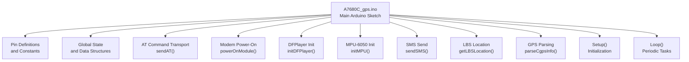
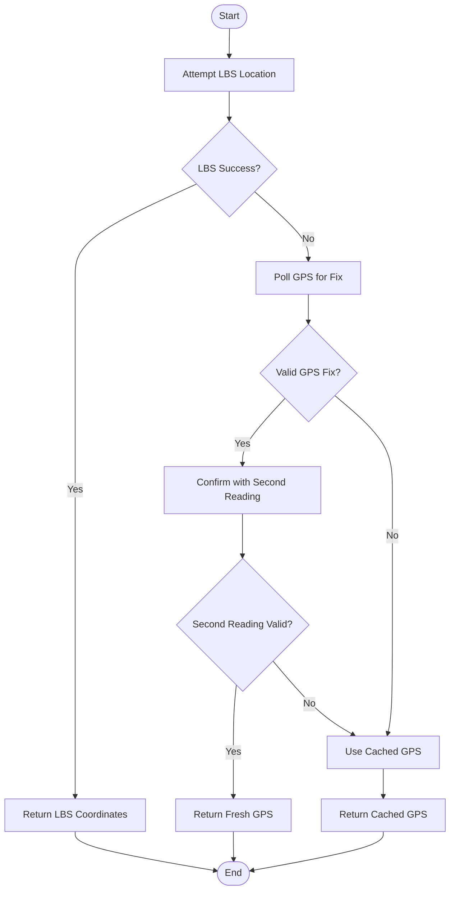
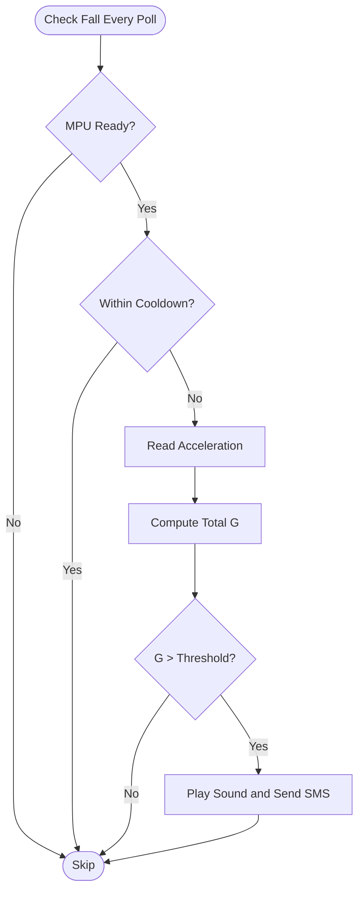
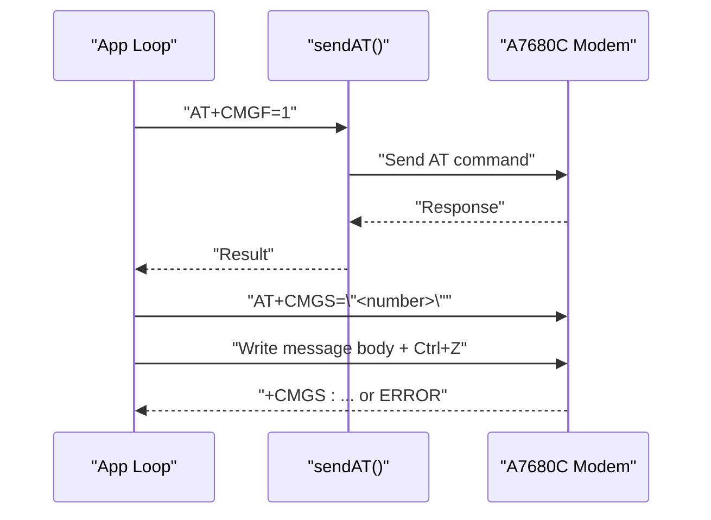
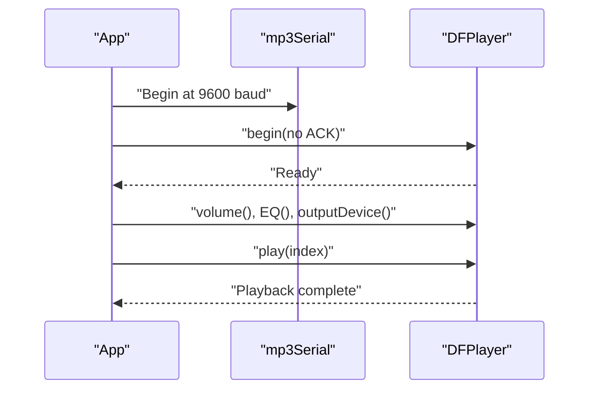
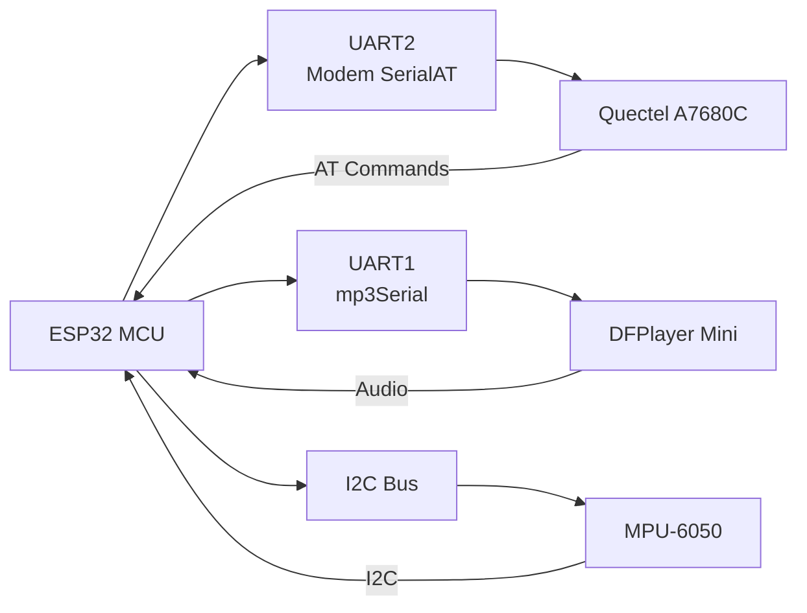

# Project Overview

<cite>
**Referenced Files in This Document**
- [A7680C_gps.ino](file://A7680C_gps.ino)
</cite>

## Table of Contents
1. [Introduction](#introduction)
2. [Project Structure](#project-structure)
3. [Core Components](#core-components)
4. [Architecture Overview](#architecture-overview)
5. [Detailed Component Analysis](#detailed-component-analysis)
6. [Dependency Analysis](#dependency-analysis)
7. [Performance Considerations](#performance-considerations)
8. [Troubleshooting Guide](#troubleshooting-guide)
9. [Conclusion](#conclusion)

## Introduction
This document presents a comprehensive overview of the A7680C GPS Tracker project, a minimal embedded solution designed for fall detection and continuous location monitoring. It targets an ESP32 microcontroller paired with a Quectel A7680C cellular/GNSS module. The system emphasizes simplicity and reliability by using straightforward AT commands to power and query the GNSS receiver, polling for position fixes, and falling back to cell-tower-based location (LBS) when GPS is unavailable. Audio feedback is provided via a DFPlayer mini module, while motion-based fall detection leverages an MPU-6050 accelerometer. Emergency alerts are delivered through SMS messages to a predefined phone number.

The project is written in the Arduino/ESP32 ecosystem and demonstrates a practical embedded workflow: device startup, GNSS initialization, periodic location reporting, real-time fall detection, and SMS-based emergency notifications.

## Project Structure
At the heart of the project is a single Arduino sketch that orchestrates hardware initialization, GNSS and LBS location retrieval, fall detection, audio feedback, and SMS messaging. The code is organized into logical sections:
- Pin definitions and constants
- Global state and data structures
- AT command transport with silence-based response detection
- Modem power-on routine
- DFPlayer initialization and audio playback
- MPU-6050 initialization and fall detection logic
- SMS composition and transmission
- LBS and GPS location retrieval strategies
- Setup and main loop routines



**Diagram sources**
- [A7680C_gps.ino](file://A7680C_gps.ino#L20-L98)
- [A7680C_gps.ino](file://A7680C_gps.ino#L103-L132)
- [A7680C_gps.ino](file://A7680C_gps.ino#L138-L147)
- [A7680C_gps.ino](file://A7680C_gps.ino#L153-L213)
- [A7680C_gps.ino](file://A7680C_gps.ino#L227-L240)
- [A7680C_gps.ino](file://A7680C_gps.ino#L265-L302)
- [A7680C_gps.ino](file://A7680C_gps.ino#L308-L330)
- [A7680C_gps.ino](file://A7680C_gps.ino#L461-L512)
- [A7680C_gps.ino](file://A7680C_gps.ino#L555-L627)
- [A7680C_gps.ino](file://A7680C_gps.ino#L633-L718)

**Section sources**
- [A7680C_gps.ino](file://A7680C_gps.ino#L1-L718)

## Core Components
- Target Hardware
  - ESP32 microcontroller with Quectel A7680C cellular/GNSS module
  - DFPlayer mini audio module for voice prompts
  - MPU-6050 6-axis motion sensor for fall detection
- Core Functionality
  - GNSS location tracking via AT commands
  - LBS (cell tower) location fallback
  - Real-time fall detection using accelerometer thresholds
  - Audio feedback via pre-recorded MP3 files
  - SMS-based emergency and status alerts

Key implementation highlights:
- GNSS power-on and selection between AT+CGNSS and AT+CGPS command sets
- LBS-first location retrieval for fast updates, with GPS and cached GPS as fallbacks
- Periodic location reporting and satellite status monitoring
- Fall detection with cooldown to avoid repeated alerts
- SMS text mode configuration and message delivery with acknowledgment parsing

**Section sources**
- [A7680C_gps.ino](file://A7680C_gps.ino#L1-L11)
- [A7680C_gps.ino](file://A7680C_gps.ino#L23-L34)
- [A7680C_gps.ino](file://A7680C_gps.ino#L59-L62)
- [A7680C_gps.ino](file://A7680C_gps.ino#L86-L98)
- [A7680C_gps.ino](file://A7680C_gps.ino#L583-L598)
- [A7680C_gps.ino](file://A7680C_gps.ino#L308-L330)
- [A7680C_gps.ino](file://A7680C_gps.ino#L341-L450)
- [A7680C_gps.ino](file://A7680C_gps.ino#L242-L259)
- [A7680C_gps.ino](file://A7680C_gps.ino#L265-L302)

## Architecture Overview
The system architecture combines hardware peripherals with AT command-based communication to the A7680C module. The ESP32’s UART interfaces are dedicated to the modem and DFPlayer, while I2C connects the MPU-6050. The main loop performs three concurrent tasks:
- Continuous fall detection sampling
- Periodic location retrieval (LBS-first)
- Background GNSS polling and satellite status display

```mermaid
graph TB
subgraph "ESP32"
U1["UART2<br/>SerialAT (Modem)"]
U2["UART1<br/>mp3Serial (DFPlayer)"]
I2C["I2C Bus"]
CPU["CPU Loop"]
end
subgraph "Peripherals"
MDM["Quectel A7680C<br/>GNSS/Cellular"]
DF["DFPlayer Mini<br/>MP3 Playback"]
MPU["MPU-6050<br/>Accelerometer/Gyroscope"]
end
CPU --> U1
CPU --> U2
CPU --> I2C
U1 <- --> MDM
U2 <- --> DF
I2C <- --> MPU
```

**Diagram sources**
- [A7680C_gps.ino](file://A7680C_gps.ino#L68-L71)
- [A7680C_gps.ino](file://A7680C_gps.ino#L23-L34)
- [A7680C_gps.ino](file://A7680C_gps.ino#L227-L240)
- [A7680C_gps.ino](file://A7680C_gps.ino#L153-L213)

## Detailed Component Analysis

### GPS Principles and Implementation
- GNSS Power and Selection
  - The system powers the GNSS engine and attempts to detect whether the module supports AT+CGNSS or AT+CGPS command sets. This avoids complex NMEA streaming and reduces initialization overhead.
- Location Retrieval Strategies
  - LBS-first approach prioritizes fast cell-tower location for frequent updates, falling back to GPS when LBS is unavailable. A secondary GPS confirmation pass ensures accuracy.
  - As a last resort, the system uses the most recent valid GPS fix stored in memory.



**Diagram sources**
- [A7680C_gps.ino](file://A7680C_gps.ino#L341-L450)
- [A7680C_gps.ino](file://A7680C_gps.ino#L354-L378)
- [A7680C_gps.ino](file://A7680C_gps.ino#L400-L425)

**Section sources**
- [A7680C_gps.ino](file://A7680C_gps.ino#L583-L598)
- [A7680C_gps.ino](file://A7680C_gps.ino#L341-L450)
- [A7680C_gps.ino](file://A7680C_gps.ino#L354-L378)
- [A7680C_gps.ino](file://A7680C_gps.ino#L400-L425)

### Fall Detection Concepts and Implementation
- Conceptual Overview
  - Fall detection relies on sudden deceleration or high resultant acceleration measured by the MPU-6050. The system integrates acceleration magnitude over short intervals and compares against a configurable threshold. A cooldown period prevents repeated triggering during a single event.
- Implementation Details
  - Accelerometer readings are fetched and combined into a total G-force value. If it exceeds the threshold, a fall is declared, and the system proceeds to capture a location and send an emergency SMS.



**Diagram sources**
- [A7680C_gps.ino](file://A7680C_gps.ino#L242-L259)
- [A7680C_gps.ino](file://A7680C_gps.ino#L634-L650)

**Section sources**
- [A7680C_gps.ino](file://A7680C_gps.ino#L59-L62)
- [A7680C_gps.ino](file://A7680C_gps.ino#L242-L259)
- [A7680C_gps.ino](file://A7680C_gps.ino#L634-L650)

### SMS Communication Workflow
- Text Mode Setup
  - The system switches the modem to text mode and composes messages with a Google Maps link derived from the current coordinates.
- Delivery and Acknowledgment
  - Messages are sent with a terminal control character to finalize transmission. Responses are parsed to detect successful delivery or errors.



**Diagram sources**
- [A7680C_gps.ino](file://A7680C_gps.ino#L265-L302)

**Section sources**
- [A7680C_gps.ino](file://A7680C_gps.ino#L265-L302)

### Audio Feedback (DFPlayer)
- Initialization
  - The DFPlayer is initialized on a dedicated UART with strict timing and error handling. Volume, EQ, and output device are configured, and a test playback verifies readiness.
- Playback
  - Pre-recorded MP3 files are selected by index to provide audible feedback for events such as boot-up, location availability, SMS sent, and fall detection.



**Diagram sources**
- [A7680C_gps.ino](file://A7680C_gps.ino#L153-L213)

**Section sources**
- [A7680C_gps.ino](file://A7680C_gps.ino#L153-L213)
- [A7680C_gps.ino](file://A7680C_gps.ino#L215-L221)

### Complete Tracking Workflow (Beginner-Friendly)
- Device Startup
  - The device powers on the modem, initializes the DFPlayer and MPU-6050, selects the appropriate GNSS command set, and sends a boot SMS with the first available location (preferably LBS).
- Ongoing Operation
  - Every 5 seconds, the system checks for a fall. If detected, it captures a location (LBS-first) and sends an emergency SMS.
  - Every 10 seconds, the system sends a periodic location update via SMS.
  - Background GNSS polling displays satellite count and fix quality for diagnostics.

```mermaid
sequenceDiagram
participant Boot as "Setup()"
participant GPS as "Location Retrieval"
participant SMS as "sendSMS()"
participant DF as "playSound()"
participant Loop as "loop()"
Boot->>GPS : "getLocationLBSFirst()"
GPS-->>Boot : "Coordinates or empty"
Boot->>SMS : "Boot message"
Boot->>DF : "Play tracker online"
Loop->>Loop : "Every 50ms : checkFallDetected()"
alt Fall Detected
Loop->>GPS : "getLocationLBSFirst()"
GPS-->>Loop : "Coordinates or empty"
Loop->>SMS : "Emergency message"
Loop->>DF : "Play fall detected"
end
Loop->>Loop : "Every 10s : periodic report"
Loop->>GPS : "getLocationLBSFirst()"
GPS-->>Loop : "Coordinates"
Loop->>SMS : "Location SMS"
```

**Diagram sources**
- [A7680C_gps.ino](file://A7680C_gps.ino#L555-L627)
- [A7680C_gps.ino](file://A7680C_gps.ino#L633-L718)
- [A7680C_gps.ino](file://A7680C_gps.ino#L341-L378)
- [A7680C_gps.ino](file://A7680C_gps.ino#L634-L650)
- [A7680C_gps.ino](file://A7680C_gps.ino#L652-L675)

**Section sources**
- [A7680C_gps.ino](file://A7680C_gps.ino#L555-L627)
- [A7680C_gps.ino](file://A7680C_gps.ino#L633-L718)

## Dependency Analysis
- Hardware Dependencies
  - ESP32 UART2 for the modem (pins 16/17), UART1 remapped for DFPlayer (pins 26/27), I2C for MPU-6050 (pins 21/22).
- Library Dependencies
  - Adafruit_MPU6050, Adafruit_Sensor, DFRobotDFPlayerMini, HardwareSerial, Wire.
- Software Dependencies
  - AT command sequences for GNSS power/status, LBS location queries, SMS text mode, and DFPlayer configuration.



**Diagram sources**
- [A7680C_gps.ino](file://A7680C_gps.ino#L68-L71)
- [A7680C_gps.ino](file://A7680C_gps.ino#L23-L34)
- [A7680C_gps.ino](file://A7680C_gps.ino#L13-L17)

**Section sources**
- [A7680C_gps.ino](file://A7680C_gps.ino#L13-L17)
- [A7680C_gps.ino](file://A7680C_gps.ino#L68-L71)
- [A7680C_gps.ino](file://A7680C_gps.ino#L23-L34)

## Performance Considerations
- GNSS Initialization
  - Prefer AT+CGNSSPWR=1 and automatic status detection to minimize initialization time and avoid unnecessary NMEA streaming.
- Location Retrieval
  - LBS-first strategy reduces latency for periodic updates. GPS polling is kept lightweight and only for diagnostics.
- Fall Detection
  - Sampling every 50 ms balances responsiveness with CPU usage. The cooldown prevents redundant triggers.
- SMS Transmission
  - Text mode simplifies message sending. Acknowledgment parsing ensures reliable delivery feedback.
- Audio Feedback
  - DFPlayer initialization includes retries and verification to avoid hangs and ensure robust playback.

[No sources needed since this section provides general guidance]

## Troubleshooting Guide
- Modem Not Responding
  - Verify power-on pulse timing and pin assignments. Confirm AT, ATE0, and CMEE settings are applied.
- GNSS Fix Never Acquired
  - Check satellite count polling and command set selection. Ensure the GNSS power command succeeds.
- LBS Location Fails
  - Retry with GPS fallback and confirm cached GPS availability.
- SMS Fails to Send
  - Validate text mode activation and recipient number. Inspect response parsing for errors.
- DFPlayer Not Detected
  - Reinitialize UART timing and disable ACK waits. Confirm SD card presence and file indices.

**Section sources**
- [A7680C_gps.ino](file://A7680C_gps.ino#L138-L147)
- [A7680C_gps.ino](file://A7680C_gps.ino#L583-L598)
- [A7680C_gps.ino](file://A7680C_gps.ino#L518-L549)
- [A7680C_gps.ino](file://A7680C_gps.ino#L265-L302)
- [A7680C_gps.ino](file://A7680C_gps.ino#L153-L213)

## Conclusion
The A7680C GPS Tracker delivers a robust, minimal embedded solution for fall detection and location monitoring. By leveraging straightforward AT commands, LBS-first location retrieval, and reliable SMS delivery, it achieves dependable operation in real-world scenarios. The modular design allows easy extension for additional features while maintaining simplicity and low power consumption suitable for battery-powered wearable applications.

[No sources needed since this section summarizes without analyzing specific files]